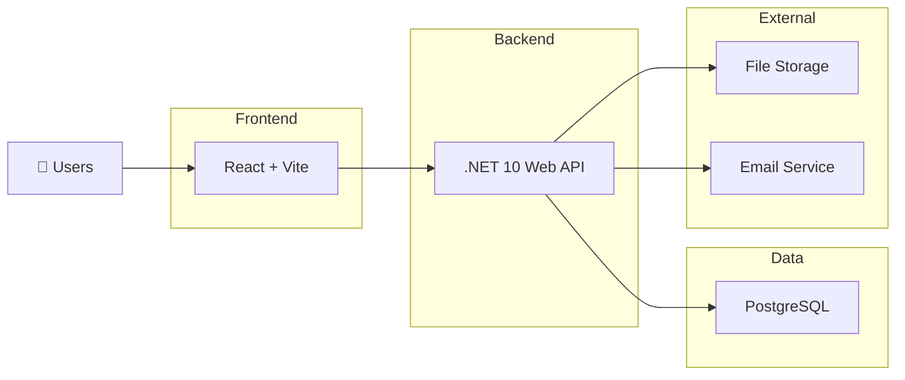

# High-Level Architecture

## Overview

Operix follows a modular layered architecture designed for scalability, maintainability, and extensibility. The platform is built as a modular monolith, allowing new business modules to be added without affecting existing functionality.

---

## Architecture Diagram

---

## Technology Stack

| Layer | Technology |
|--------|------------|
| Frontend | React + TypeScript + Vite |
| Backend | .NET 10 Web API |
| Database | PostgreSQL |
| ORM | Entity Framework Core |
| Authentication | JWT |
| Styling | Tailwind CSS |

---

## System Components

### Frontend

- User Interface
- Routing
- Forms
- API Communication

### Backend

- Business Logic
- REST APIs
- Authentication & Authorization
- Validation

### Database

- Application Data
- Asset Information
- Maintenance Records
- Inventory
- Audit Logs

### External Services

- Email
- File Storage
- Future Integrations

---

## Design Principles

- Modular Architecture
- Separation of Concerns
- Scalability
- Security
- Maintainability
- Extensibility

---

## Next Step

The next document defines the internal backend structure using Clean Architecture.

**Next:** `03-clean-architecture.md`