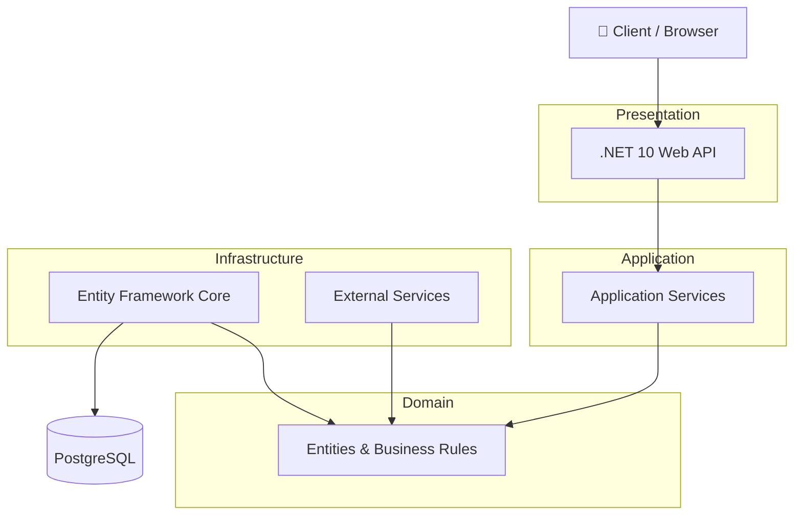

# Clean Architecture

## Overview

Operix follows the **Clean Architecture** pattern to separate business logic from infrastructure and external dependencies. This keeps the application maintainable, testable, and scalable.

---

## Architecture


---

## Layer Responsibilities

| Layer | Responsibility |
|--------|----------------|
| Presentation | API endpoints, middleware, authentication |
| Application | Use cases, workflow orchestration, validation |
| Domain | Entities, business rules, domain interfaces |
| Infrastructure | Database, repositories, external services |

---

## Dependency Rule

Dependencies always point toward the **Domain**.

```text
Presentation
      ↓
Application
      ↓
Domain
      ↑
Infrastructure
```

The **Domain** layer must remain independent and should not depend on any other layer.

---

## Benefits

- Separation of concerns
- Independent business logic
- Easier testing
- Better maintainability
- Scalable architecture