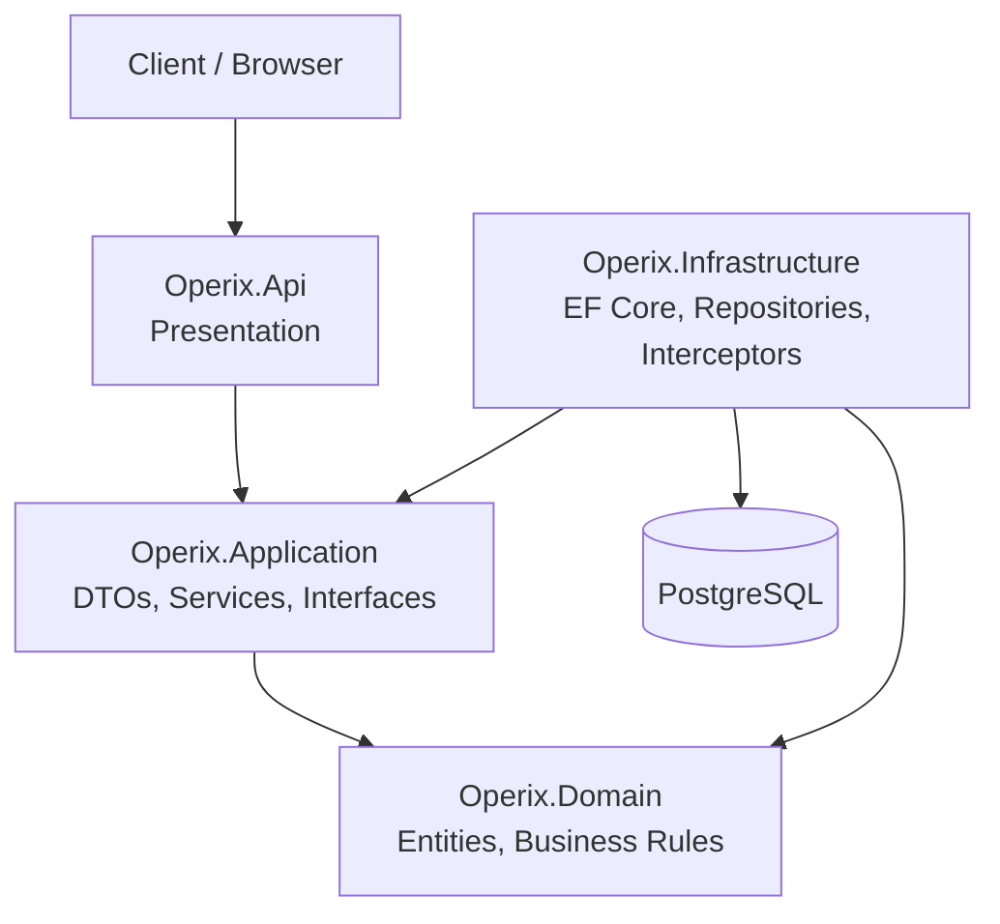

# Clean Architecture

## Overview

Operix follows the **Clean Architecture** pattern to separate business logic from infrastructure and external dependencies. This keeps the application maintainable, testable, and scalable.

---

## Architecture



## Key Architectural Principles

1. **Clean Architecture**
   - `Api → Application → Domain`
   - Infrastructure implements Application abstractions.

2. **Domain Independence**
   - Domain does not depend on EF Core, PostgreSQL, or ASP.NET.

3. **Thin Controllers**
   - Controllers handle HTTP concerns only.

4. **Application Services**
   - Handle use cases and application workflow.

5. **DTOs**
   - API contracts use DTOs instead of Domain entities.

6. **Repository Pattern**
   - Interfaces live in Application.
   - Implementations live in Infrastructure.

7. **Validation**
   - API → HTTP validation.
   - Application → use-case validation.
   - Domain → business rules.

---

## Layer Responsibilities

| Layer          | Responsibility                                |
| -------------- | --------------------------------------------- |
| Presentation   | API endpoints, middleware, authentication     |
| Application    | Use cases, workflow orchestration, validation |
| Domain         | Entities, business rules, domain interfaces   |
| Infrastructure | Database, repositories, external services     |

---

## Dependency Rule

Dependencies always point toward the **Domain**.

```text
Presentation
      ↓
Application
      ↓
Domain
      ↑
Infrastructure
```

The **Domain** layer must remain independent and should not depend on any other layer.

---

## Benefits

- Separation of concerns
- Independent business logic
- Easier testing
- Better maintainability
- Scalable architecture
